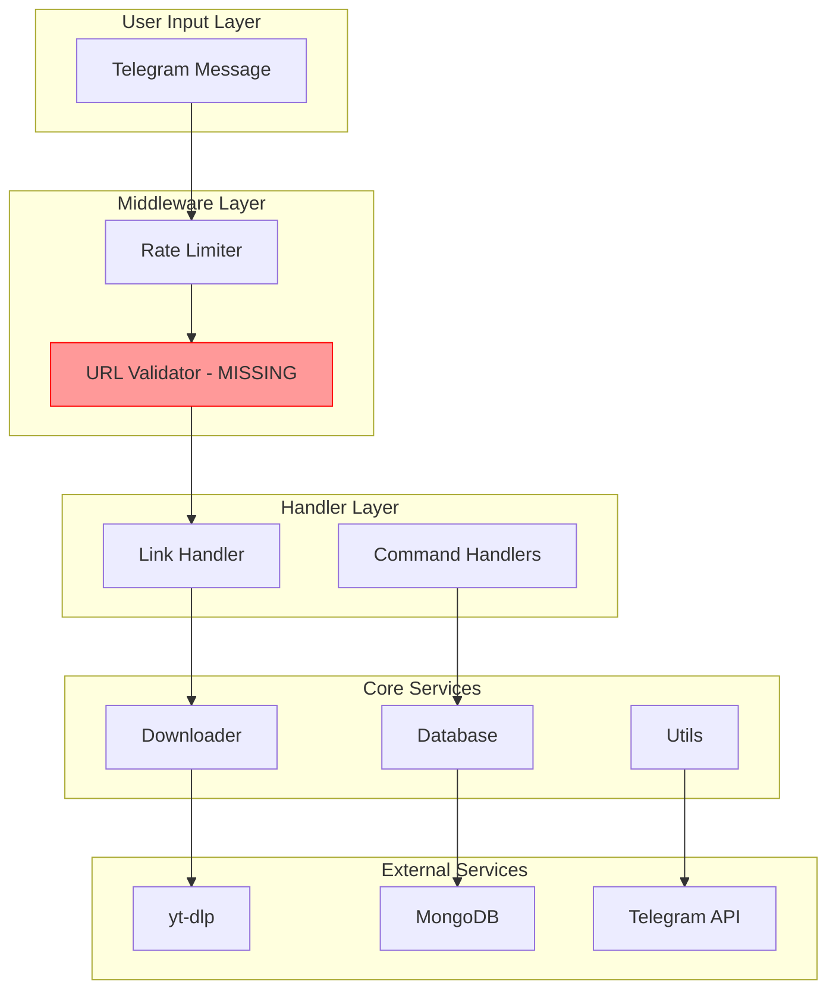

# TikTok Bot Security Audit and Fix Plan

## Summary of Issues Found

| Severity | Count | Categories |

|----------|-------|------------|

| Critical | 6 | URL validation, XSS, DB error handling, async close |

| High | 8 | File cleanup, resource leaks, rate limiting, config validation |

| Medium | 8 | Error handling, timeouts, blocking I/O, input validation |

| Low | 4 | Type hints, logging, documentation |

---

## Critical Issues (Must Fix)

### 1. No URL Validation (SSRF Risk)

**File:** [src/handlers.py](src/handlers.py) line 92-107

- Current regex `r'(https?://[^\s]+)'` is too permissive
- No domain whitelist (could request internal/localhost URLs)
- No URL length limit (DoS risk)

**Fix:** Add URL validation with domain whitelist:

```python
from urllib.parse import urlparse

ALLOWED_DOMAINS = ['youtube.com', 'youtu.be', 'tiktok.com', 'vm.tiktok.com', 
                   'facebook.com', 'fb.watch', 'instagram.com', 'twitter.com', 'x.com']

def validate_url(url: str) -> bool:
    if len(url) > 2048:
        return False
    parsed = urlparse(url)
    if parsed.scheme not in ['http', 'https']:
        return False
    if any(domain in parsed.netloc for domain in ALLOWED_DOMAINS):
        return True
    return False
```

### 2. XSS Vulnerability (HTML Injection)

**File:** [src/handlers.py](src/handlers.py) line 141-145

- `title` from yt-dlp inserted into HTML without escaping
- User-provided caption also not sanitized

**Fix:** Use `html.escape()`:

```python
from html import escape
caption = f"📌 Title: {escape(result.get('title', 'Unknown'))}\n"
```

### 3. Database Error Returns Wrong Value

**File:** [src/database.py](src/database.py) line 51

- On error, returns `{"downloads_count": 10}` instead of `0`
- Allows unlimited downloads when DB fails

**Fix:** Change to `downloads_count: 0`

### 4. Async Close Not Awaited

**File:** [src/database.py](src/database.py) line 103

- `self.client.close()` should be `await self.client.close()`
- Causes connection leaks

### 5. Missing LOG_CHANNEL_ID in .env.example

**File:** [.env.example](.env.example)

- Code requires `LOG_CHANNEL_ID` but not documented

### 6. No Graceful Shutdown

**File:** [main.py](main.py) line 59-63

- Missing signal handlers (SIGTERM, SIGINT)
- Web server not cleaned up in finally block
- `dp.stop_polling()` not called before closing

---

## High Priority Issues

### 7. Thread Pool Never Shut Down

**File:** [src/downloader.py](src/downloader.py) line 52

- `ThreadPoolExecutor` created but never shut down
- Resource leak on application exit

### 8. File Cleanup Gaps

**File:** [src/downloader.py](src/downloader.py)

- Files only cleaned in handler's finally block
- If download fails before returning, files remain

### 9. Rate Limiting Silent Rejection

**File:** [src/middleware.py](src/middleware.py) line 37-39

- User receives no response when rate limited
- Causes confusion and retries

### 10. No BOT_TOKEN/MONGO_URI Validation

**File:** [src/config.py](src/config.py)

- Invalid tokens/URIs cause runtime failures
- Should validate format at startup

### 11. Blocking I/O in Async Handler

**File:** [src/handlers.py](src/handlers.py) line 171

- `os.remove()` blocks event loop
- Should use `asyncio.to_thread()` or `aiofiles`

### 12. No Download Timeout

**File:** [src/handlers.py](src/handlers.py) line 133

- Downloads can hang indefinitely
- Should use `asyncio.wait_for()` with timeout

---

## Medium Priority Issues

### 13. Generic Exception Handling

**Files:** Multiple locations

- Catches all exceptions, masking specific errors
- Error messages may leak sensitive info

### 14. Admin Check Uses String Comparison

**File:** [src/handlers.py](src/handlers.py) line 69

- `str(message.from_user.id) != str(ADMIN_ID)`
- Should use integer comparison

### 15. Memory-Based Rate Limiting

**File:** [src/middleware.py](src/middleware.py) line 14

- Not persistent across restarts
- No cleanup for old entries (memory leak)

### 16. Logging Uses print() Instead of logger

**File:** [src/utils.py](src/utils.py) line 17

- Errors not captured in logs

---

## Architecture Diagram



---

## Files to Modify

1. **[src/handlers.py](src/handlers.py)** - URL validation, XSS fix, timeouts, async file ops
2. **[src/downloader.py](src/downloader.py)** - Thread pool shutdown, file cleanup
3. **[src/database.py](src/database.py)** - Fix async close, error return value, connection pool
4. **[src/middleware.py](src/middleware.py)** - Rate limit feedback, error handling
5. **[src/config.py](src/config.py)** - Add validation for BOT_TOKEN, MONGO_URI, PORT
6. **[src/utils.py](src/utils.py)** - Input sanitization, fix logging
7. **[main.py](main.py)** - Graceful shutdown, web server cleanup
8. **[.env.example](.env.example)** - Add LOG_CHANNEL_ID

---

## Security Score

**Current: 5/10** - Functional but needs hardening before production

**After fixes: 8/10** - Production ready with basic security